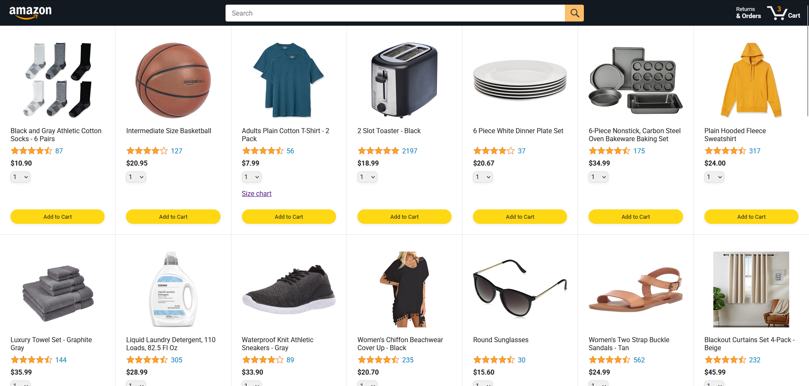

# Amazon-Clone: JavaScript Full Course
This is a personal learning experience for JavaScript, guided by the 22-hour long course from **SuperSimpleDev**.

<u>YouTube Video</u>: [JavaScript Tutorial Full Course - Beginner to Pro](https://www.youtube.com/watch?v=EerdGm-ehJQ "JavaScript Tutorial Full Course - Beginner to Pro")

There are 18 lessons each with over 250+ challenges and exercises, which are published here as a cloud resource.

The Amazon Clone project was <u>started</u> on **May 16, 2025** and accomplished <u>completion</u> on **June 14, 2025**. 

## Steps to Reproduce
**Recommended IDE: Visual Studio Code**
1. Install the <b>Live Server Extension</b>.
2. Open any HTML webpage you want to open.
3. Click the `Go Live` button in your VS Code app.
4. To change webpages:
    1. Use filepaths after your local address and port. Example: `http://127.0.0.1:5500/amazon.html`
